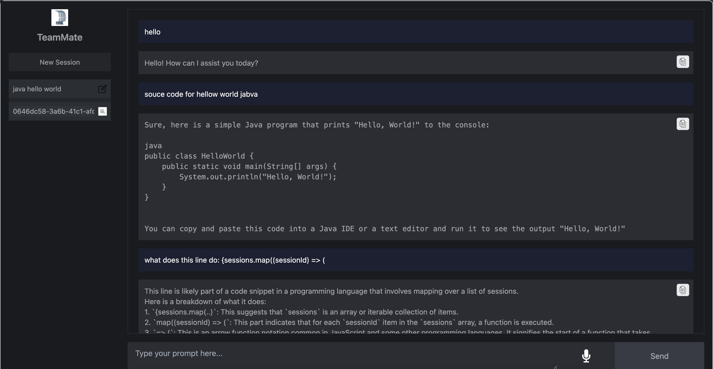

# Team-Mate

TeamMate is a personalized LLM-enhanced agent. It serves as a supportive digital assistant to help students manage their tasks effectively, facilitate collaboration, and access necessary resources effortlessly.  
Key Services Provided by Team-Mate:
- Personalised Interaction: 
- Adaptive Learning and Support: 
- Proactive Planning and Scheduling: 
- Blocker Resolution: 
- Enhance collaboration: 

This repository is the front end of the agent.

## Repository Structure

```
.
├── README.md
├── __pycache__
│   └── main.cpython-310.pyc
├── main.py
└── weaviate
    ├── __init__.py
    ├── __pycache__
    │   ├── __init__.cpython-310.pyc
    │   ├── http_client.cpython-310.pyc
    │   ├── schema_manager.cpython-310.pyc
    │   ├── weaviate_client.cpython-310.pyc
    │   └── weaviate_interface.cpython-310.pyc
    ├── docker-compose.yml
    ├── http_client.py
    ├── schema.json
    ├── schema_manager.py
    ├── weaviate_client.py
    └── weaviate_interface.py
```

## Getting Started

### Weaviate Setup

1. Fork the repository.
2. Clone the repository:
   ```sh
   git clone https://github.com/your-username/team-mate.git
   ```
3. Navigate to the `weaviate` subfolder:
   ```sh
   cd team-mate/weaviate
   ```
4. Run the Weaviate Docker container:
   ```sh
   docker-compose up
   ```

### Project Setup

1. Fork the repository.
2. Clone the repository:
   ```sh
   git clone https://github.com/your-username/team-mate.git
   ```
3. Navigate to the project directory:
   ```sh
   cd team-mate
   ```
4. Set up a virtual environment:
   ```sh
   python3 -m venv .venv
   source .venv/bin/activate
   ```
5. Install the required packages:
   ```sh
   pip install fastapi uvicorn python-socketio
   ```
6. Create a `.env` file in the project root directory with the following variables:
   ```env
   OPENAI_API_KEY=your_openai_api_key
   WEAVIATE_URL=http://localhost:8080
   ```
7. Run the project:
   ```sh
   python main.py
   ```

## Important Notes

**Features in the works**
- Delete session
- Remove session leakage
- User accounts
- Landing page
- Audio handling
- update knowlage base
- Make search more robust and swicth to vector based
- Upgrade model? cost vs performance

  
## Contributions

We welcome contributions and suggestions! Feel free to fork the repository, make improvements, and submit a pull request.

## License

This project is licensed under the MIT License.



